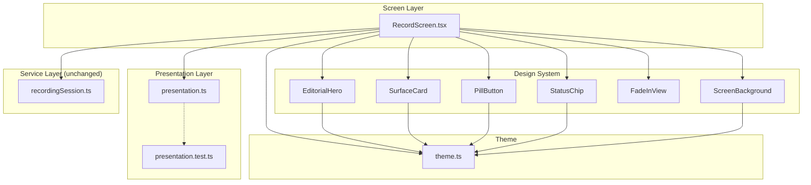

# Design Document: Recording Screen UI Revamp

## Overview

This design covers the full UI/UX revamp of the "New Recording" tab (`RecordScreen.tsx`). The goal is to replace the current ad-hoc layout and inline styles with a polished, editorial-quality screen built entirely from the existing design system primitives (`EditorialHero`, `SurfaceCard`, `PillButton`, `StatusChip`, `SectionHeading`, `FadeInView`, `ScreenBackground`) and theme tokens (`palette`, `typography`, `radii`, `elevation`, `ambient`).

The underlying recording state machine (`recordingSession.ts`) and service layer remain untouched. All changes target:

1. The presentation layer (`src/features/recording/presentation.ts`) — expanded with new pure functions for all user-facing copy, status mappings, and accessibility labels.
2. The screen component (`src/screens/RecordScreen.tsx`) — rewritten to compose design system components, consume presentation functions, and use only theme tokens for styling.
3. The co-located test file (`src/features/recording/presentation.test.ts`) — expanded to cover every new presentation function.

## Architecture



The data flow is unidirectional:

1. `RecordScreen` subscribes to `recordingSession` for the current `RecordingSessionSnapshot`.
2. `RecordScreen` passes `snapshot.phase` and `snapshot.durationMillis` to presentation functions.
3. Presentation functions return copy strings, StatusChip tones, PillButton variants, and accessibility labels.
4. `RecordScreen` passes these values as props to design system components.

No new services, stores, or data sources are introduced.

## Components and Interfaces

### Presentation Layer API (`src/features/recording/presentation.ts`)

The presentation module is expanded from 3 functions to ~15 pure functions. Each function takes at most a `RecordingPhase` or `durationMillis` argument and returns a string or a small object.

```typescript
import type { StatusChipTone } from '../../components/ui/StatusChip';

type RecordingPhase = 'idle' | 'recording' | 'saving' | 'error';

// --- Hero Section ---
function getHeroEyebrow(): string;
function getHeroHeadline(): string;
function getHeroBody(): string;

// --- Recording Controls Card ---
function getTitlePlaceholder(): string;

// --- Status Indicator ---
function getStatusLabel(phase: RecordingPhase): string;
function getStatusTone(phase: RecordingPhase): StatusChipTone;

// --- Record/Stop Button ---
function getButtonLabel(phase: RecordingPhase): string;
function getButtonVariant(phase: RecordingPhase): 'primary' | 'danger';
function getButtonDisabled(phase: RecordingPhase): boolean;
function getButtonIconName(phase: RecordingPhase): string;

// --- Notice Banner ---
function getNoticeTitle(): string;
function getNoticeBody(): string;

// --- Consent Footer ---
function getConsentHeading(): string;
function getConsentBody(): string;

// --- Accessibility ---
function getTimerAccessibilityLabel(durationMillis: number): string;
function getButtonAccessibilityLabel(phase: RecordingPhase): string;
```

### RecordScreen Composition

The screen composes design system components in this order inside a `KeyboardAwareScrollView`:

```
ScreenBackground (absolute, behind content)
└─ KeyboardAwareScrollView
   ├─ FadeInView delay=0
   │  └─ EditorialHero (eyebrow, headline, body from presentation)
   ├─ FadeInView delay=70
   │  └─ SurfaceCard (default variant)
   │     ├─ SectionHeading (title="Meeting title")
   │     ├─ TextInput (placeholder from presentation, a11y label="Meeting title")
   │     ├─ StatusChip (label + tone from presentation, a11y label from presentation)
   │     ├─ Timer (display typography, a11y label from presentation)
   │     └─ PillButton (label, variant, icon, disabled, a11y label — all from presentation)
   ├─ FadeInView delay=140
   │  └─ SurfaceCard muted
   │     ├─ SectionHeading (title from getNoticeTitle)
   │     └─ Text (body from getNoticeBody)
   └─ FadeInView delay=210
      ├─ SectionHeading (title from getConsentHeading)
      └─ Text (body from getConsentBody)
```

### Design System Component Usage

| Component | Location | Props / Variant |
|---|---|---|
| `ScreenBackground` | Behind scroll content | (no props) |
| `EditorialHero` | Top of scroll | `eyebrow`, `title`, `body` |
| `SurfaceCard` | Controls card | default (non-muted) |
| `SurfaceCard` | Notice banner | `muted` |
| `StatusChip` | Inside controls card | `label`, `tone`, `accessibilityLabel` |
| `PillButton` | Inside controls card | `label`, `variant`, `icon`, `disabled`, `onPress`, `accessibilityLabel` |
| `SectionHeading` | Notice title, Consent title | `title` |
| `FadeInView` | Wraps each top-level section | `delay` (staggered: 0, 70, 140, 210) |
| `KeyboardAwareScrollView` | Main scroll container | `contentContainerStyle` with gap ≥ 16 |

### PillButton Accessibility Extension

The existing `PillButton` component does not accept an `accessibilityLabel` prop. The component will be extended to pass through an optional `accessibilityLabel` to the underlying `Pressable`. Similarly, `StatusChip` will be extended to accept and forward an `accessibilityLabel`.

## Data Models

No new data models are introduced. The feature consumes the existing `RecordingSessionSnapshot` type:

```typescript
type RecordingPhase = 'idle' | 'recording' | 'saving' | 'error';

type RecordingSessionSnapshot = {
  phase: RecordingPhase;
  titleDraft: string;
  durationMillis: number;
  errorMessage: string | null;
};
```

The presentation layer maps `phase` (a 4-value enum) and `durationMillis` (a non-negative integer) to UI strings and tokens. No persistence, no new types.

## Correctness Properties

*A property is a characteristic or behavior that should hold true across all valid executions of a system — essentially, a formal statement about what the system should do. Properties serve as the bridge between human-readable specifications and machine-verifiable correctness guarantees.*

Most acceptance criteria in this feature map to a small, finite input space (4 recording phases) or are deterministic functions with no arguments. These are best covered by exhaustive example-based tests. One criterion operates over a large input space:

### Property 1: Timer accessibility label produces a valid human-friendly string for any duration

*For any* non-negative integer `durationMillis`, `getTimerAccessibilityLabel(durationMillis)` SHALL return a non-empty string that contains only human-friendly time units (e.g., "minutes", "seconds") and does not contain raw millisecond values or numeric-only output.

**Validates: Requirements 9.2, 9.5**

## Error Handling

This feature does not introduce new error paths. The recording session's existing error handling (permission denied, save failure, Drive upload failure) remains unchanged and surfaces via `Alert.alert` in the screen component.

The presentation layer is pure and cannot throw — every function returns a deterministic string or token for every valid input. Invalid phases (values outside the 4-member enum) are not expected at runtime since TypeScript enforces the type, but the `getStatusLabel` / `getButtonLabel` functions will include a default/fallback branch that returns a sensible value for defensive coding.

## Testing Strategy

### Unit Tests (Example-Based)

The primary testing approach for this feature. All tests live in `src/features/recording/presentation.test.ts`.

Coverage targets:
- Every presentation function returns a non-empty string (smoke coverage for Req 7.3)
- `getStatusLabel` / `getStatusTone` return correct values for all 4 phases (Req 3.2–3.5)
- `getButtonLabel` / `getButtonVariant` / `getButtonDisabled` / `getButtonIconName` return correct values for all 4 phases (Req 4.2–4.6)
- `getNoticeBody` does not contain "force-quit" (Req 5.4)
- `getHeroBody` contains at most two sentences (Req 1.4)
- `getTimerAccessibilityLabel` returns expected strings for specific durations: 0ms, 1000ms, 61000ms, 3661000ms (Req 9.2)
- `getButtonAccessibilityLabel` returns descriptive labels for all 4 phases (Req 9.1)

### Property-Based Tests

One property test using `fast-check`:

- **Property 1**: Generate random non-negative integers for `durationMillis`, call `getTimerAccessibilityLabel`, assert the result is a non-empty string matching a human-friendly time format.
- Minimum 100 iterations.
- Tag: `Feature: recording-screen-ui-revamp, Property 1: Timer accessibility label produces a valid human-friendly string for any duration`

### Code Review Checks (Not Automated)

- `RecordScreen.tsx` contains no hardcoded user-facing strings (Req 7.1, 7.2)
- All styles use theme tokens — no hex colors, hardcoded font weights, or magic border radii (Req 8.4)
- `FadeInView` wrappers use staggered delays (Req 8.2)
- Content gap ≥ 16px (Req 8.3)

### What Is NOT Tested

- Visual appearance, animation smoothness, editorial tone quality — these are subjective and verified through design review
- Recording session state machine behavior — unchanged, already tested in `recordingSession.test.ts`
- Component rendering / snapshots — the project does not currently have React component tests, and this revamp follows that convention
